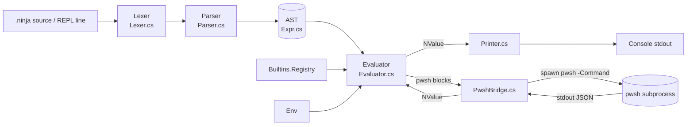

# NinjaShell — F#-flavored object-pipeline shell for TerminalNinja

## Context

TerminalNinja already has a native terminal layer (`TerminalNinja.Terminal/` with a working `ConPtyTerminalBackend` + `VtParser`). The next missing piece is a **native shell language** to run inside it:

- Tiny, expression-oriented surface — `let`, lambdas with `(args) => expr`, `|` (pipe), records, C#-style `expr switch { … }`, `$"{interp}"`, pipeline builtins `where` / `select`, and `pwsh { ... }`. **No** if/else, no bare-word commands, no list destructuring in `switch` for MVP.
- Object pipelines like PowerShell, but built on **our own immutable value model** — no `PSObject`, no reflection.
- A native escape hatch to PowerShell (`pwsh { ... }`) so the existing cmdlet ecosystem is one keyword away.
- The runtime value model is built on **C# 15 native discriminated unions** (the new `union` keyword), so we get an exhaustive, compiler-checked sum type for `NValue` instead of a hand-rolled `abstract record` hierarchy.

This plan covers the **MVP**: a working REPL with the language core, the object pipeline, and a `pwsh` subprocess bridge. Hosting the REPL inside a `TerminalView` is deliberately deferred.

### Locked decisions (from intake)

| Question | Choice |
|---|---|
| Project home | New sibling project `TerminalNinja.Shell/` (added to `TerminalNinja.slnx`) |
| Language role | New language, F#-flavored, our own lexer/parser/interpreter |
| PowerShell interop | Spawn `pwsh` subprocess per block, JSON channel (CLIXML is a follow-up) |
| Pipeline objects | `union NValue(...)` over case-typed records — native C# 15 DU |
| Toolchain | .NET 11 Preview 2+, C# 15 (preview), `IsAotCompatible=true`, `TreatWarningsAsErrors=true` |
| MVP scope | REPL + pipelines + pwsh bridge — no `TerminalView` hosting yet |
| Naming | NinjaShell language, `.ninja` source files, executable `ninja` |

### MVP shape at a glance



## Toolchain — .NET 11 preview + C# 15 unions

Per the C# 15 union types announcement, unions are available starting with **.NET 11 Preview 2**, project must target `net11.0`, and they remain a preview feature. Two consequences for this repo:

1. **`global.json` change** (repo-wide): bump the SDK pin and allow preview.

   Current:
   ```json
   { "sdk": { "version": "10.0.0", "rollForward": "latestMajor", "allowPrerelease": false } }
   ```
   New:
   ```json
   { "sdk": { "version": "11.0.100-preview.2.25500", "rollForward": "latestFeature", "allowPrerelease": true } }
   ```
   (Pin to whatever preview build is current at implementation time — record the actual version in Phase 1's PR description.) The .NET 11 SDK still builds `net10.0` targets, so **only the new Shell project moves to `net11.0`**; all existing sibling projects (`TerminalNinja`, `TerminalNinja.Terminal`, `TerminalNinja.Tests`, etc.) stay on `net10.0` unless they actively need union types.

2. **Shell csproj** targets `net11.0` with `<LangVersion>preview</LangVersion>` (C# 15 is preview). All other settings mirror `TerminalNinja.Terminal/TerminalNinja.Terminal.csproj` (`Nullable`, `ImplicitUsings`, `TreatWarningsAsErrors`, `IsAotCompatible`) plus `<OutputType>Exe</OutputType>` from `TerminalNinja.Cli/TerminalNinja.Cli.csproj`.

**Risks to verify in Phase 1, before building the rest:**

- *AOT compatibility of unions.* The article doesn't explicitly confirm Native AOT support. Unions compile to structs holding `object?`, which is reflection-free and should be AOT-clean — but we have `TreatWarningsAsErrors=true`, so any IL2026/IL3050 warning fails the build. **Phase 1 exit criterion: `dotnet publish -c Release -r linux-x64` of the empty Shell project succeeds with zero AOT warnings.** If it fails, fall back to a sealed `abstract record` hierarchy (kept in the same shape) and downgrade target to `net10.0`.
- *Self-referential unions.* `NValue` is recursive (`NList(ImmutableArray<NValue>)`). The article doesn't address this case. Mitigation: cases are declared as their own records, and the union takes those record names — the compiler sees the union after the records, so the recursion goes through named types, not anonymous parameters. Phase 1 builds a one-line smoke (`var v = (NValue)new NInt(1);`) to confirm.

## Project layout

```
TerminalNinja.Shell/
├── TerminalNinja.Shell.csproj   # Exe, net11.0, LangVersion=preview, AOT-compat, no PackageReferences
├── Program.cs                   # Wires REPL or runs a script file
├── Lexer/
│   ├── Token.cs                 # TokenKind enum + Token record (Kind, Text, Line, Col)
│   └── Lexer.cs                 # Hand-rolled state machine — mirror VtParser.cs style
├── Parser/
│   └── Parser.cs                # Recursive descent → AST; PS-aware brace scanner for pwsh{…}
├── Ast/
│   └── Expr.cs                  # Sealed record hierarchy under one file
├── Values/
│   └── NValue.cs                # Case records + `union NValue(...)` declaration
├── Runtime/
│   ├── Env.cs                   # Immutable persistent scope (ImmutableDictionary<string, NValue>)
│   ├── Evaluator.cs             # Tree-walking interpreter; switch-expressions on NValue
│   └── Pipeline.cs              # |> implementation; eager IEnumerable<NValue> for MVP
├── Builtins/
│   ├── Registry.cs              # static dict: name → NFunc; populated by static ctor per module
│   ├── PipelineOps.cs           # where, select, take, skip, sort, distinct, count, head, tail
│   ├── Fs.cs                    # ls, cd, pwd, cat — minimal surface
│   └── Io.cs                    # echo, print, format-table
├── PowerShell/
│   ├── PwshBridge.cs            # Spawn + stdin/stdout marshalling, JSON ↔ NValue
│   └── JsonToNValue.cs          # Utf8JsonReader-based deserializer (AOT-safe, no reflection)
└── Repl/
    ├── Repl.cs                  # Reads lines, accumulates until parser says "complete"
    └── Printer.cs               # Scalars raw; record-seqs as aligned columns
```

Wire-up edits outside the new project:

- **`global.json`**: bump SDK to .NET 11 preview, allow prerelease (see Toolchain section).
- **`TerminalNinja.slnx`**: add `<Project Path="TerminalNinja.Shell/TerminalNinja.Shell.csproj" />`.
- **`TerminalNinja.Tests/TerminalNinja.Tests.csproj`**: add `<ProjectReference Include="..\TerminalNinja.Shell\TerminalNinja.Shell.csproj" />`. Tests stay on `net10.0` and consume the shell's public/internal API across TFMs.
- **`TerminalNinja.Shell.csproj`**: add `<InternalsVisibleTo Include="TerminalNinja.Tests" />` (matches `TerminalNinja.Terminal.csproj:21`).
- Tests live in `TerminalNinja.Tests/Unit/Shell/` (flat, mirroring the existing `Unit/Terminal/` convention).

**No package references.** Everything we need is in the BCL.

## Language surface (MVP) — locked

```
// Literals + let bindings
let n = 42
let name = "Ronald"
let xs = [1, 2, 3, 4]

// Anonymous, structural records — JSON-shaped: `key: value`
let p = { Name: "Ronald", Age: 40 }
let q = { "Name": "Ronald", "Age": 40 }      // identical to p
let r = { "first name": "Ronald" }
r["first name"]                                // => "Ronald"

// Lambdas
let add    = (a, b) => a + b
let double = x => x * 2

// Function calls — always parenthesised arg list
add(1, 2)

// Object pipelines — Elixir-style: LHS becomes the *first* arg of the RHS call
xs
| where(x => x > 1)
| select(x => { Value: x, Squared: x * x })

// String interpolation
let greeting = $"hello, {name} ({p.Age})"

// PowerShell escape hatch
let procs = pwsh { Get-Process | Select-Object -First 5 Name, Id, CPU }
procs | where(p => p.CPU > 1.0)

// Pattern matching — C# switch-expression syntax
let label = x switch {
    0 => "zero",
    1 => "one",
    n => $"many: {n}"
}
```

**Record literals & access.** Fields use **`:`** as the field/value separator (JSON-style), keeping `=` exclusively for let-bindings. Keys can be either a bare identifier or a quoted string. Two access forms: dot access (identifier-shaped key) and string indexer (`r["any key"]`). Missing-key access is a runtime error. Duplicate keys in a single literal are a parse error.

**Pipe semantics (Elixir-style).** `lhs | f(a, b, ...)` desugars to `f(lhs, a, b, ...)`. The RHS must be a function-call expression or a bare function reference.

**Why `switch { … }` and not ML `match … with | … end`.** The `|` glyph is now the pipe at every expression level. C#'s switch expression sidesteps the collision: braces close the construct, arms are separated by `,` or newline, no `|` inside. The `pwsh { … }` payload is lexed as one opaque token, so PowerShell's own `|` never reaches our parser.

**Function-call rule.** Every call is `f(arg, arg, …)`. No juxtaposition, no bare-word command form, no automatic currying.

**Switch patterns in MVP**: integer / float / string / bool literals, wildcard `_`, and bare-identifier bindings. **Not** in MVP: list patterns, record-shape patterns, tuple patterns, guards, or-patterns, type patterns.

**Iteration / loops.** There is **no loop keyword**. Iterate via pipeline builtins; recurse for everything else.

```
1..10
| where(x => x > 3)
| select(x => x * x)
| fold(0, (acc, x) => acc + x)

1..3 | each(x => print($"row {x}"))

let fact = n => n switch {
    0 => 1,
    n => n * fact(n - 1)
}
```

**Range literals.** `lo..hi` is sugar for an `NList` of `NInt` values, inclusive. Empty when `lo > hi`. Integer only in MVP.

**Recursive `let`.** RHS evaluated in an env that already contains the binding. Implementation: `Env` is `ImmutableDictionary<string, EnvRef>` where `EnvRef` is a tiny mutable holder of `NValue`; `let name = expr in body` reserves the slot first, evaluates `expr`, then fills the slot. Closures capture the env (and therefore the ref). Standard knot-tying for letrec in immutable scopes.

**Pipeline builtins**: `where`, `select`, `each`, `fold`, `take`, `skip`, `count`, `sort`, `distinct`, `head`, `tail`. All take the sequence as their *first* argument.

**Out of MVP**: if/else (use a `switch` on a bool), `while` / `for`, user-defined named records/DUs, modules, static type checking, async / `let!`, structured error effects, history, completion, highlighting, terminal hosting inside `TerminalView`, range `step`/float ranges, mutual recursion across separate `let`s.

## Value model — `Values/NValue.cs` (C# 15 native union)

```csharp
namespace TerminalNinja.Shell.Values;

public sealed record NUnit { public static readonly NUnit Instance = new(); }
public sealed record NBool(bool Value);
public sealed record NInt(long Value);
public sealed record NFloat(double Value);
public sealed record NString(string Value);
public sealed record NList(ImmutableArray<NValue> Items);
public sealed record NRecord(ImmutableSortedDictionary<string, NValue> Fields);
public sealed record NVariant(string Tag, ImmutableArray<NValue> Items);
public sealed record NSeq(IEnumerable<NValue> Items);
public sealed record NFunc(Func<NValue[], NValue> Apply, int Arity);

public union NValue(
    NUnit,
    NBool,
    NInt,
    NFloat,
    NString,
    NList,
    NRecord,
    NVariant,
    NSeq,
    NFunc);
```

Notes:

- Language-level tagged union value is **`NVariant`** (not `NUnion`).
- Implicit conversions from each case type to `NValue` come from the `union` declaration.
- `NUnit.Instance` is the canonical "no value".
- All types immutable, zero reflection.

## PowerShell bridge — `PowerShell/PwshBridge.cs`

**Capturing the block at parse time.** A PS-aware brace scanner in `Parser.cs`:

1. Treat `'…'`, `"…"` (with `` ` `` escapes), `@'…'@`, `@"…"@`, `#…\n`, `<# … #>` as opaque.
2. Outside those, count `{`/`}` to find the matching close brace.
3. On EOF mid-block in the REPL, return "incomplete" so the line accumulator keeps reading.

Capture inner source verbatim into a `PwshBlock(string Body)` AST node.

**Runtime:**

1. Resolve `pwsh` once: PATH lookup; on Windows fall back to `pwsh.exe` then `powershell.exe`. Cache on `PwshBridge`.
2. Spawn `pwsh -NoProfile -NoLogo -Command "& { <Body> } | ConvertTo-Json -Depth 8 -AsArray -Compress"`. Pass the script via `-EncodedCommand` (base64-UTF16) to dodge embedded-quote hell.
3. Capture stdout to completion. Surface stderr as `new NVariant("Error", [new NString(stderr)])` for MVP.
4. Parse stdout with `Utf8JsonReader` into `NList`/`NRecord`/primitives via `JsonToNValue.cs`.

**AOT-safe JSON conversion — `PowerShell/JsonToNValue.cs`.** Reflection-based `JsonSerializer.Deserialize<T>` is not AOT-clean without a `JsonSerializerContext`. Use `Utf8JsonReader` directly:

```csharp
NValue Read(ref Utf8JsonReader r) => r.TokenType switch
{
    JsonTokenType.Null      => NUnit.Instance,
    JsonTokenType.True      => new NBool(true),
    JsonTokenType.False     => new NBool(false),
    JsonTokenType.Number    => r.TryGetInt64(out var i) ? new NInt(i) : new NFloat(r.GetDouble()),
    JsonTokenType.String    => new NString(r.GetString()!),
    JsonTokenType.StartArray  => ReadArray(ref r),
    JsonTokenType.StartObject => ReadObject(ref r),
    _ => throw new InvalidOperationException($"unexpected JSON token {r.TokenType}")
};
```

**MVP simplifications** (PR description, not code): JSON not CLIXML, one-shot subprocess per block, no coercion magic.

## Critical files / patterns to mirror

- **csproj shape**: `TerminalNinja.Terminal/TerminalNinja.Terminal.csproj:1-24` (lib) + `TerminalNinja.Cli/TerminalNinja.Cli.csproj:1-23` (`OutputType=Exe`). Override `TargetFramework` to `net11.0`, `LangVersion` to `preview`.
- **Lexer style**: `TerminalNinja.Terminal/VtParser.cs` — explicit `State` enum, `MethodImpl(AggressiveInlining)` on hot paths, no LINQ in inner loop.
- **AST + registry style**: `TerminalNinja/Xaml/XamlLoader.cs` + `TerminalNinja/Aot/ControlFactoryRegistry.cs:11-46`. Hand-maintained at MVP scale — **no new source generator**.
- **Tests**: TUnit, async, one class per type-under-test, flat under `TerminalNinja.Tests/Unit/Shell/`. See `TerminalNinja.Tests/Unit/Terminal/VtParserTests.cs:11-46`.
- **Cross-platform test gating**: `TerminalNinja.Tests/Unit/Terminal/ConPtyTerminalBackendTests.cs:29-35` — early-return when `pwsh` isn't on PATH.

## Execution phases (PR-sized; each ends with something runnable)

1. **`chore(toolchain): bump SDK to .NET 11 preview`** + **`feat(shell): scaffold project + NValue union`**
   Update `global.json`. Create `TerminalNinja.Shell.csproj`, `Values/NValue.cs`, stub `Program.cs` printing `ninja v0.0`. Add to `TerminalNinja.slnx` and tests `ProjectReference`. **Exit criteria:** (a) `dotnet build` green, (b) `dotnet publish TerminalNinja.Shell -c Release -r linux-x64` green with zero AOT warnings, (c) sibling `net10.0` projects still build.

2. **`feat(shell): lexer`**
   `Lexer/Token.cs`, `Lexer/Lexer.cs`. Token kinds: identifiers, keywords (`let`, `in`, `switch`, `pwsh`, `true`, `false`); int/float/string literals; `$"…"` produces `InterpStart`/`InterpText`/`InterpHole`/`InterpEnd`; operators `=>`, `=`, `+`, `-`, `*`, `/`, `==`, `!=`, `<`, `>`, `<=`, `>=`, `&&`, `||`, `..`; punctuation `()[]{},:.`, `|` always pipe; newline soft-significant inside `[]`/`{}`; `PwshBlockToken` payload verbatim. No `->`, `;`, `|>`, `match`/`with`/`end`. Tests in `Unit/Shell/LexerTests.cs`.

3. **`feat(shell): parser + AST`**
   `Ast/Expr.cs` (`Lit`, `Var`, `Let`, `Lambda`, `Call`, `Pipe`, `Switch`, `RecordLit`, `ListLit`, `RangeLit`, `Interp`, `PwshBlock`, `MemberAccess`, `IndexAccess`, `BinOp`). `Parser/Parser.cs` recursive descent. Precedence (loose → tight): `|` < `||` < `&&` < equality < comparison < `..` < `+`/`-` < `*`/`/` < unary < call/member/`switch`. Lambdas: `IDENT '=>' expr` or `'(' params ')' '=>' expr`. Switch: `Primary 'switch' '{' SwitchArm ((',' | NEWLINE) SwitchArm)* (',' | NEWLINE)? '}'`. Record: `'{' Field ((',' | NEWLINE) Field)* (',' | NEWLINE)? '}'` where `Field := (IDENT | STRING) ':' Expr`. Postfix tier (member precedence): chained `'.' IDENT` | `'[' Expr ']'` | `'(' Args ')'`. `switch` consumed as postfix on a primary expression. Brace disambiguation by preceding `switch` keyword. Pipe desugar: `lhs | Call(f, args)` ⇒ `Call(f, [lhs, ...args])`; `lhs | f` ⇒ `Call(f, [lhs])`. Range: `lo..hi` ⇒ `RangeLit(lo, hi)`. Round-trip tests in `Unit/Shell/ParserTests.cs`, including pipe-inside-switch-arm and nested switch.

4. **`feat(shell): evaluator + pipeline + core builtins`**
   `Runtime/Env.cs` (`ImmutableDictionary<string, EnvRef>` + `EnvRef` for letrec knot-tying), `Runtime/Evaluator.cs`, `Runtime/Pipeline.cs`, `Builtins/Registry.cs`, `Builtins/PipelineOps.cs` (`where`, `select`, `each`, `fold`, `take`, `skip`, `count`, `sort`, `distinct`, `head`, `tail`). C# switch-expressions on `NValue` use union exhaustiveness. NinjaShell `switch` arms tried top-to-bottom, bare-identifier patterns bind. Range `1..5` → `NList` of `NInt`s. Tests in `Unit/Shell/EvaluatorTests.cs` + `Unit/Shell/PipelineTests.cs`.

5. **`feat(shell): PowerShell subprocess bridge`**
   `PowerShell/PwshBridge.cs`, `PowerShell/JsonToNValue.cs`. Integration test in `Unit/Shell/PwshBridgeTests.cs` runs `pwsh { Get-Date | Select-Object Year, Month, Day }`. Skip via early-return when `pwsh` isn't resolvable.

6. **`feat(shell): minimal filesystem builtins + REPL loop`**
   `Builtins/Fs.cs`, `Builtins/Io.cs`, `Repl/Repl.cs`, `Repl/Printer.cs`. Line accumulator; continuation prompt switches from `ninja>` to `....>`. Printer aligns record-seqs as tables, scalars raw. Ties everything together.

After MVP — explicitly **not** in this plan: terminal hosting inside `TerminalView`, CLIXML, persistent pwsh runspace, user-defined named types/modules, completion/history/highlighting, streaming `NSeq`, a `Builtins` source generator, finalization of `LangVersion`.

## Verification

- `dotnet build` at solution root succeeds with `TreatWarningsAsErrors=true` on .NET 11 preview SDK; `net10.0` siblings still build.
- `dotnet publish TerminalNinja.Shell/TerminalNinja.Shell.csproj -c Release -r linux-x64` (and `win-x64`) produces working AOT binary with **zero IL2026 / IL3050 warnings** — the gate confirming `union NValue(...)` is AOT-clean. Fallback in Toolchain section if it fails.
- `dotnet run --project TerminalNinja.Tests/TerminalNinja.Tests.csproj --treenode-filter "/*/*/(LexerTests)|(ParserTests)|(EvaluatorTests)|(PipelineTests)|(PwshBridgeTests)/*"` green.
- **Manual smoke** — `dotnet run --project TerminalNinja.Shell/TerminalNinja.Shell.csproj` opens `ninja>`:
  - `let xs = [1, 2, 3] in xs | where(x => x > 1)` → `[2, 3]`
  - `[{ Name: "a", N: 1 }, { "Name": "b", "N": 2 }] | select(r => r.Name)` → `["a", "b"]`
  - `{ "first name": "Ronald", "last name": "Q" }["first name"]` → `"Ronald"`
  - `let add = (a, b) => a + b in add(2, 3)` → `5`
  - `1..5 | fold(0, (acc, x) => acc + x)` → `15`
  - `let fact = n => n switch { 0 => 1, n => n * fact(n - 1) } in fact(5)` → `120`
  - `1 switch { 0 => "zero", n => $"got {n}" }` → `"got 1"`
  - `pwsh { Get-Date | Select-Object Year, Month, Day }` → record with three int fields
  - `pwsh { Get-Process | Select-Object -First 3 Name, Id } | where(p => p.Id > 1000) | select(p => p.Name)` → string list, end-to-end PS → NinjaShell pipeline
  - Multi-line entry: `let f =` ⏎ `  x => x * 2` ⏎ completes the binding.
